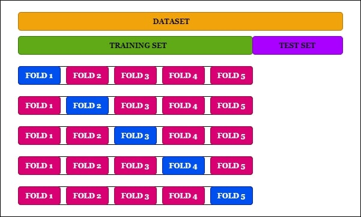

#K-Fold Cross Validation
K-Fold Cross Validation is a resampling method that divides the available data into K equally sized subsets, or folds. The algorithm then iteratively trains and evaluates the model K times, using a different fold as the validation set in each iteration. This process provides a more accurate estimate of the model's performance by reducing the bias introduced by a single train-test split.
