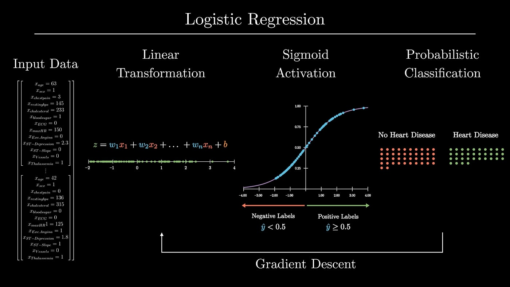

# Logistic Regression
Logistic Regression is a supervised learning algorithm used for binary classification. It models the relationship between the input features and the probability of the target variable belonging to a certain class. Logistic Regression uses the logistic function, also known as the sigmoid function, to map the input features to a probability score. The algorithm is trained using optimization techniques such as Maximum Likelihood Estimation or Gradient Descent.

