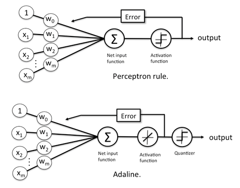

#Perceptron Vs Adaline
Both the Perceptron and Adaline are linear classification algorithms, but they employ different strategies for updating the model weights during training:

  -Perceptron: The Perceptron algorithm uses a step function as the activation function. It updates the weights based on the misclassified samples until all samples are classified correctly or a maximum number of iterations is reached. The Perceptron focuses on finding a linear decision boundary that separates the two classes.

  -Adaline (Adaptive Linear Neuron): Adaline, in contrast, uses a linear activation function. It employs an iterative approach to minimize the cost function, usually based on the sum of squared errors. Adaline aims to find the weights that minimize the difference between the predicted output and the true output, taking into account continuous values instead of discrete classifications.
  
  
