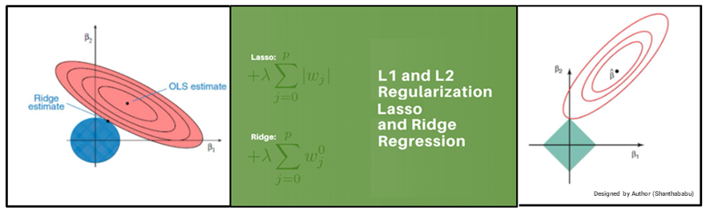

# Regularization
Overfitting occurs when a model learns to fit the training data too closely, resulting in poor performance on unseen data. Regularization techniques introduce additional constraints to the model training process to control its complexity and prevent overfitting. This repository includes implementations of the following regularization techniques:

  -L1 Regularization (Lasso): Adds a penalty term to the loss function based on the absolute values of the model weights. This encourages sparsity in the learned weights, leading to feature selection and simpler models.

  -L2 Regularization (Ridge): Adds a penalty term to the loss function based on the squared magnitudes of the model weights. This encourages smaller weights and helps prevent overfitting.
  
 
